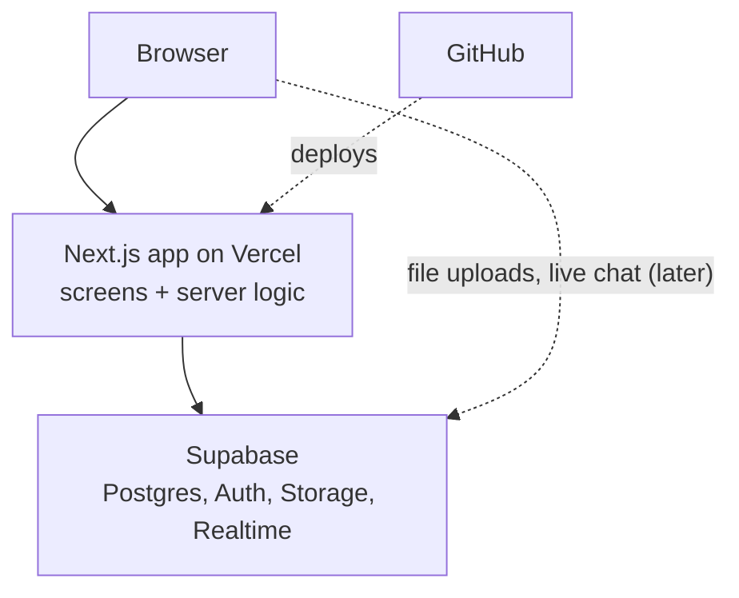

# Wedding App

A wedding planning app. **MVP scope: contacts, timeline and RSVPs, host-only.**

## Architecture

| Piece | What it does |
|---|---|
| **Next.js** (`src/`) | The app — screens *and* server logic in one codebase |
| **Vercel** | Hosts the Next.js app |
| **Supabase** | Postgres database, authentication, and (later) file storage + live chat |



There is deliberately **no separate backend service**. Server logic runs inside
Next.js. If scheduled reminders or long-running chatbot work need an always-on
worker later, that gets added as a third piece — the two above don't change.

## Getting set up

1. **Create a Supabase project** at [supabase.com](https://supabase.com).
2. **Run the schema.** In the Supabase dashboard, open the SQL Editor and paste
   the contents of `supabase/migrations/0001_init.sql`, then run it.
3. **Add your keys.** Copy `.env.example` to `.env.local` and fill in the URL and
   anon key from Supabase's API settings.
4. **Install and run:**
   ```bash
   npm install
   npm run dev
   ```
   Open http://localhost:3000.

## Where things live

```
src/
  app/          screens and routes
    design/     the design system catalogue — every component on one page
  components/
    ui/         the building blocks: Button, Card, Field, Badge, ...
  lib/
    db/         every database query lives here — nothing else queries directly
    supabase/   client setup for browser, server and middleware
  types/        TypeScript types mirroring the database
supabase/
  migrations/   the database schema
docs/
  ERD.md        the data model, explained
  DESIGN.md     the design system, explained
```

The `lib/db` rule matters: keeping queries in one folder is what would let a
separate backend service be split out later without touching the screens.

## How it looks

Warm and romantic — cream paper, dusty rose, deep plum ink. Every colour, font
and component is on one page at **`/design`**
([live](https://wedding-app-tau-dusky.vercel.app/design)), and explained in
[`docs/DESIGN.md`](docs/DESIGN.md).

Colours are named rather than written as hex codes (`bg-canvas`, `text-ink`,
`bg-rose-500`). They're all defined in `tailwind.config.ts` — change the look
there, not in the screens.

## Data model

See [`docs/ERD.md`](docs/ERD.md). The short version: everything belongs to a
**wedding**, and people get access through `wedding_members`. Guest access is
already designed for — it's a role in that table, not a rebuild.

## Not built yet

Chatbot, guest access, guest-to-guest messaging, seating plans, gift registry,
photo uploads. All additive — they hang off the existing schema.

## Verifying tenant isolation

`supabase/tests/rls_isolation.sql` proves that one couple cannot read or write
another couple's data. It sets up two weddings, signs in as one couple, and
fails loudly if anything leaks. Run it against a scratch database with the
migration applied — it rolls itself back, so it leaves no data behind.
