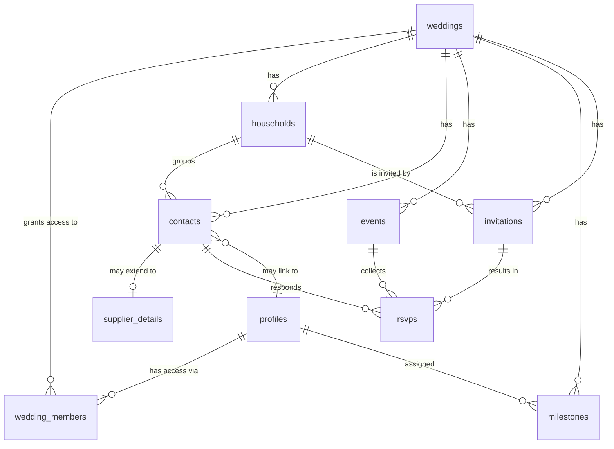

# Wedding App — Data Model (MVP)

Covers the MVP scope: **contacts, timeline, RSVP — host-only**, built on a
multi-tenant foundation so guest access can be layered on later without a rebuild.

---

## The idea in one paragraph

Everything in the app belongs to a **wedding**. A wedding is the "tenant" — the
box that all data sits inside. People get access to a wedding through
`wedding_members`, which records what role they have. Today the only roles that
matter are owner and planner. When guest access arrives, it becomes another row
in that same table with a different role — no new tables, no migration of
existing data.

---

## Diagram

---

## Tables

### Foundation

**`profiles`** — one row per logged-in person. Mirrors Supabase's built-in
`auth.users` table so we can attach our own fields (display name, avatar)
without touching the auth system.

| Column | Type | Notes |
|---|---|---|
| `id` | uuid PK | Same id as `auth.users.id` |
| `full_name` | text | |
| `email` | text | |
| `avatar_url` | text | |
| `created_at` | timestamptz | |

**`weddings`** — the tenant. Every other table hangs off this.

| Column | Type | Notes |
|---|---|---|
| `id` | uuid PK | |
| `name` | text | e.g. "Frankie & Sam" |
| `wedding_date` | date | Nullable — dates move |
| `venue_contact_id` | uuid FK → contacts | Nullable, set once venue is booked |
| `created_by` | uuid FK → profiles | |
| `created_at` | timestamptz | |

**`wedding_members`** — the access-control hinge. **This is the table that makes
guest mode cheap later.**

| Column | Type | Notes |
|---|---|---|
| `id` | uuid PK | |
| `wedding_id` | uuid FK → weddings | |
| `user_id` | uuid FK → profiles | |
| `role` | enum | `owner`, `planner`, `guest` |
| `contact_id` | uuid FK → contacts | Nullable — links a guest login to their guest record |
| `created_at` | timestamptz | |

> Unique on (`wedding_id`, `user_id`) — one membership per person per wedding.

The `guest` role already exists in the enum but nothing issues it yet. When guest
access ships, a guest signs up, gets a `wedding_members` row with `role='guest'`
and `contact_id` pointing at their own contact record — and the permission rules
already written will do the rest.

---

### Contacts

**`households`** — the unit you actually invite. "Mr & Mrs Smith + 2 kids" get
one invitation and one envelope, but four separate RSVPs.

| Column | Type | Notes |
|---|---|---|
| `id` | uuid PK | |
| `wedding_id` | uuid FK → weddings | |
| `name` | text | "The Smith Family" |
| `address_line1` / `line2` / `city` / `postcode` / `country` | text | For save-the-dates |
| `created_at` | timestamptz | |

**`contacts`** — every person or organisation attached to the wedding.

| Column | Type | Notes |
|---|---|---|
| `id` | uuid PK | |
| `wedding_id` | uuid FK → weddings | |
| `household_id` | uuid FK → households | Nullable — suppliers have none |
| `contact_type` | enum | `guest`, `supplier`, `bridal_party`, `venue` |
| `first_name` / `last_name` | text | |
| `email` / `phone` | text | |
| `notes` | text | |
| `is_child` | boolean | Affects catering and seating later |
| `created_at` | timestamptz | |

**`supplier_details`** — suppliers need fields guests don't (cost, contract,
booking status). Rather than leaving a dozen empty columns on every guest row,
supplier data lives in its own table with a 1-to-1 link.

| Column | Type | Notes |
|---|---|---|
| `contact_id` | uuid PK, FK → contacts | |
| `company_name` | text | |
| `category` | text | photographer, florist, catering… |
| `status` | enum | `researching`, `enquired`, `booked`, `cancelled` |
| `quoted_cost` / `deposit_paid` | numeric | |
| `contract_url` | text | |

---

### Events & RSVP

**`events`** — a wedding is rarely one event. Ceremony, reception, rehearsal
dinner, next-day brunch. **RSVPs are per event**, because someone might come to
the evening do but not the ceremony.

| Column | Type | Notes |
|---|---|---|
| `id` | uuid PK | |
| `wedding_id` | uuid FK → weddings | |
| `name` | text | "Ceremony", "Evening reception" |
| `starts_at` / `ends_at` | timestamptz | |
| `location` | text | |
| `created_at` | timestamptz | |

**`invitations`** — one per household. Carries the secret token that will become
the guest's RSVP link.

| Column | Type | Notes |
|---|---|---|
| `id` | uuid PK | |
| `wedding_id` | uuid FK → weddings | |
| `household_id` | uuid FK → households | |
| `token` | text UNIQUE | Random — the "wedding.app/rsvp/abc123" link |
| `sent_at` | timestamptz | Nullable until sent |
| `created_at` | timestamptz | |

**`rsvps`** — one row per person, per event.

| Column | Type | Notes |
|---|---|---|
| `id` | uuid PK | |
| `wedding_id` | uuid FK → weddings | Denormalised for simple permission rules |
| `invitation_id` | uuid FK → invitations | |
| `contact_id` | uuid FK → contacts | |
| `event_id` | uuid FK → events | |
| `status` | enum | `pending`, `attending`, `declined` |
| `meal_choice` | text | |
| `dietary_notes` | text | |
| `responded_at` | timestamptz | |

> Unique on (`contact_id`, `event_id`) — one answer per person per event.

---

### Timeline

**`milestones`** — the planning checklist.

| Column | Type | Notes |
|---|---|---|
| `id` | uuid PK | |
| `wedding_id` | uuid FK → weddings | |
| `title` | text | |
| `description` | text | |
| `category` | text | venue, attire, catering… maps to the hub UI's dots |
| `due_date` | date | |
| `remind_at` | timestamptz | Nullable — unused until reminders ship |
| `status` | enum | `todo`, `in_progress`, `done`, `skipped` |
| `assigned_to` | uuid FK → profiles | Nullable |
| `completed_at` | timestamptz | |
| `created_at` | timestamptz | |

---

## How security works

Every table carries a `wedding_id`, and Postgres enforces a rule on each one:
*you can only see rows for a wedding you're a member of.* This is checked by the
database itself, not by app code — so a bug in a screen can't leak another
couple's guest list.

The rule is written once as a helper function (`is_wedding_member`) and reused
everywhere. When guest access ships, guest restrictions are added to these same
rules rather than replacing them.

---

## Decisions worth knowing about

**Why households?** Because invitations go to households but RSVPs come from
individuals. Skipping this makes seating and catering painful later.

**Why per-event RSVPs?** Day guests vs evening guests is close to universal.
Retrofitting it later would mean rewriting every RSVP row.

**Why is `guest` already in the role enum?** So the foundation is genuinely
built for it, per the brief — the column doesn't need to change when guest
access ships.

**What's deliberately left out:** seating and tables, gift registry, chat
messages, photo albums, chatbot history. All are additive — new tables hanging
off `weddings` — and none require changing what's above.
